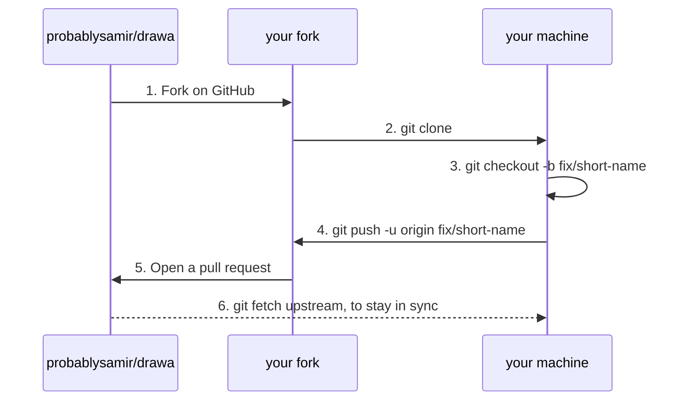
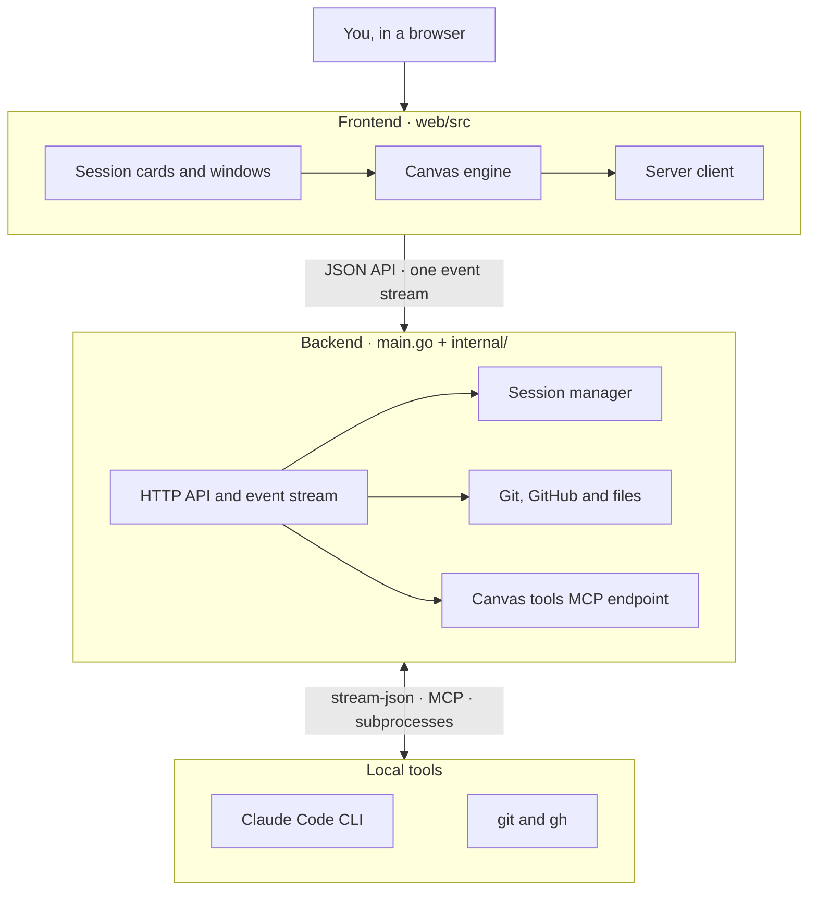

# Contributing to Drawa

Thanks for helping out. This page covers running Drawa from source and finding your way around the code. [`CLAUDE.md`](CLAUDE.md) holds the rules the codebase follows (where things go, the registries, styling and performance rules). Read it before a non-trivial change, whether you write the code yourself or an agent does.

Everyone taking part is expected to follow the [Code of Conduct](CODE_OF_CONDUCT.md).

## Ways to contribute

You can contribute in several ways:

- [Reporting bugs](#reporting-bugs)
- [Suggesting features](#suggesting-features)
- [Suggesting enhancements and improvements](#suggesting-enhancements-and-improvements)
- Writing or improving documentation (`README.md`, `INSTALL.md` and this file)
- Submitting bug fixes or enhancements (see [Making a change](#making-a-change))

Looking for a place to start? Try issues labeled [`good first issue`](https://github.com/probablysamir/drawa/labels/good%20first%20issue) or [`help wanted`](https://github.com/probablysamir/drawa/labels/help%20wanted). Comment on an issue before you start so two people don't work on the same thing.

Security problems don't go in public issues. See [`SECURITY.md`](SECURITY.md).

## Reporting bugs

Search open and closed issues first. If nobody has reported it yet, open one with the [Bug report](https://github.com/probablysamir/drawa/issues/new?template=bug_report.yml) template. It asks for:

- What you did, what you expected, and what happened instead.
- Your OS, browser, Drawa version (`drawa --version`, or the commit if you run from source) and `claude --version`.
- Any errors from the browser console and from the terminal running Drawa.
- A screenshot or recording, if the bug is visible. Blur out project paths and code you can't share.

## Suggesting features

A feature is something Drawa can't do yet. Open an issue with the [Feature request](https://github.com/probablysamir/drawa/issues/new?template=feature_request.yml) template. Describe the problem before the solution: what you were trying to do and what got in the way. [`PRODUCT.md`](PRODUCT.md) explains what Drawa is trying to be, and a proposal that fits it is easier to accept. Wait for a maintainer to agree on the direction before you start a large change.

## Suggesting enhancements and improvements

An enhancement makes something Drawa already does better: faster, clearer, easier to reach or more accessible. Open an issue with the [Enhancement](https://github.com/probablysamir/drawa/issues/new?template=enhancement.yml) template. Name the part of Drawa, describe how it behaves now and how it should behave, and add a screenshot if the change is visible.

## Development setup

You need Go 1.22+, Node 20.19+ (or 22.12+) and [Claude Code](https://claude.com/claude-code) on `PATH`.

Work on your own fork (see [Making a change](#making-a-change)): only maintainers can push to this repository.

```sh
git clone https://github.com/<your-username>/drawa.git
cd drawa/web && npm install && npm run build
cd .. && go run . /path/to/project
```

When run from source, the server rebuilds and restarts itself whenever a `.go` file changes. A build that fails to compile keeps the old server running.

For hot reload of the UI:

```sh
cd web && DRAWA_ROOT=/path/to/project npm run dev
```

Open http://localhost:5173. This also builds and starts the Go server, unless one is already running on port 8765. It starts it with `DRAWA_DEV=1`, which makes the server trust the Vite dev origin (port 5173); without it the server refuses requests from that page. If you run the Go server yourself for dev, set `DRAWA_DEV=1` too.

## Making a change

Contributors don't push to `probablysamir/drawa` directly. Every change goes through a fork and a pull request:



1. Fork the repository on GitHub ("Fork" at the top right), clone your fork, and add this repository as `upstream`:

   ```sh
   git clone https://github.com/<your-username>/drawa.git
   cd drawa
   git remote add upstream https://github.com/probablysamir/drawa.git
   ```

   Then create a branch from an up-to-date `main`, one branch per change:

   ```sh
   git fetch upstream
   git checkout -b fix/short-name upstream/main   # or feat/, docs/
   ```

   Push the branch to your fork (`git push -u origin fix/short-name`) and open the pull request from there. Never work on your fork's `main`. When `main` moves on while you work, merge it in with `git fetch upstream && git merge upstream/main`.
2. Keep one change per pull request. A bug fix doesn't need to bring a refactor along.
3. Follow [`CLAUDE.md`](CLAUDE.md). A new feature plugs into the existing registries (`persist()`, `referable()`, `creatable()`...) instead of adding special cases. Go code uses the standard library only, and the frontend gets no new dependency for something a few lines can do.
4. Update the docs in the same pull request when you change behavior, a shortcut or a setting (`README.md`), or add a folder or a registry (`CLAUDE.md`).
5. Write commit messages as a short sentence in the imperative that says what changes, the way the history does: `Git window: say git isn't installed instead of offering git init`.

## Before you open a pull request

```sh
(cd web && npm run build)   # tsc + Vite build, must pass with no new errors
go vet ./... && go test ./...
```

For anything visible, check it in both the light and dark themes, at phone width (390px), and after a page reload (the layout restores from saved state). See ["Before you finish any change"](CLAUDE.md#before-you-finish-any-change) in `CLAUDE.md`.

## Opening the pull request

Fill in the pull request template:

- Link the issue it resolves (`Closes #12`).
- Describe what changed and why, and what you tested. List anything you couldn't test (another OS, say).
- For visible changes, add before/after screenshots in light and dark themes.
- Keep the pull request as a draft until it's ready for review. Answer review comments with new commits rather than a force-push, so reviewers can see what changed.

Maintainers cut releases. A merged pull request ships in the next one.

## Architecture



Arrows inside the frontend show which way imports go. The rules for where code goes are in [`CLAUDE.md`](CLAUDE.md).

## License

Drawa is licensed under the [GNU Affero General Public License v3.0](LICENSE). By opening a pull request, you agree that your contribution is licensed under the same terms.
